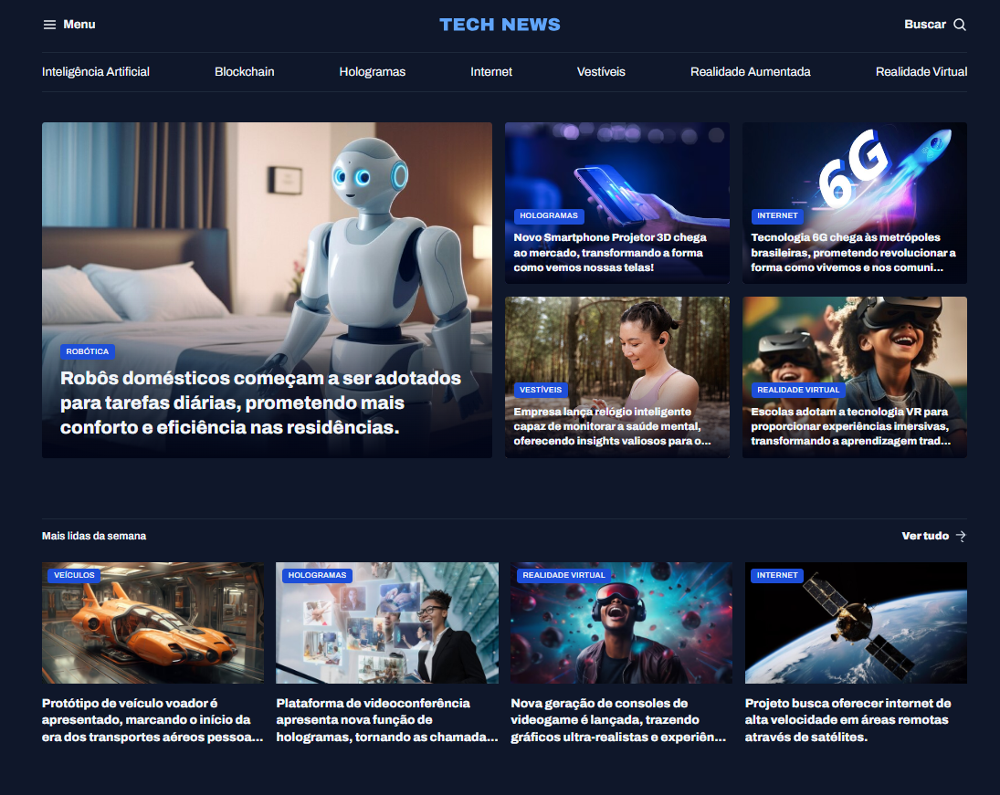

Projeto de um Portal de notícias desenvolvido durante as aulas de Grid na Rocketseat.

 
## Tecnologias

Esse projeto foi desenvolvido com as seguintes tecnologias:

- HTML
- CSS

## Projeto

Nesse projeto iremos desenvolver um portal de notícias para praticar o nosso conhecimento com o Grid!
